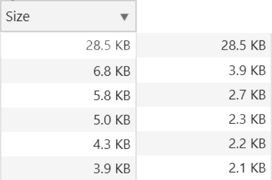

# Performance matters

## Week 1
### Getting started
```shell
git clone https://github.com/maanlamp/performance-matters-1819

cd "performance-matters-1819"

node .
```

En BAM, klaar!.

### Tooling
Er is nog geen tooling. Waarschijnlijk zal ik gewoon NPM scripts gebruiken als nodig.

## Week 2
### Performance-optimalisatie
Ik heb mijn best gedaan om de volgende punten aan te pakken:
- First view
- Repeat view
- Perceived per
- Image loading

#### First view
##### webfont-optimalisatie
Het eerste dat ik wilde optimaliseren was het webfont dat ik gebruik. Dingen die daarvoor te optimaliseren vallen zijn:
Hoeveelheid bytes die moeten worden gedownload
Render-blocking voorkomen
Sneller/slimmer bytes downloaden

###### Hoeveelheid bytes die moeten worden gedownload
Om het aantal bytes te verlagen heb ik compression middleware gebruikt. Zie hier de resultaten van die compression op de grootste 6 bestanden van mijn pagina.


###### Render-blocking voorkomen
Het downloaden van een webfont op slow 3G begint rond 3 seconden in de request, en is volledig gedownload na 6 seconden. Dat is redelijk snel. Misschien kan ik door preloaden nog betere performance krijgen -- dat ga ik later onderzoeken. Het grootste probleem is dat het een volle 6 seconden duurt voordat het lettertype ingeladen is. Dat is gewoon 2x langer dan de download, en dus niet acceptabel. 6 volle seconden waarin je niks kunt lezen terwijl de tekst er al staat.

Ik heb een simpel script geschreven, met hulp van dit artikel over font-display, dat de fonts pas na page-load inlaadt, en het originele font vervangt. Dit is acceptabel omdat het standaardfont niet veel verschilt. Zo heb ik 6 seconden aan onleesbare tekst bespaard!
Sneller/slimmer bytes downloaden
Het mooie van de Google-fonts api die ik gebruik, is dat ze automatisch resource hints bijvoegen met de CSS-import die je kunt gebruiken. Zo kan de browser bijvoorbeeld sneller een fallback gebruiken als aangegeven wordt dat een font “woff2”-formaat is, en de browser dat niet ondersteunt. Ik wilde graag een "correctere" manier implementeren voor het laden en cachen van fonts, maar daar heb ik de tijd niet voor gehad.

#### Repeat view
Door goed om te gaan met caches in-browser en via een service worker is de repeat-view bijna instant. Het langste wachten is op de html, de rest is gecachet.

#### Perceived performance
Dit heb ik niet per se tijdens dit vak geïmplementeerd, maar om de gebruiker op alle acties feedback te geven, heb ik skeleton loading toegepast op zowel het autosuggest-veld als de zoekresultaten. Zo lijkt de applicatie beter en sneller te werken.

#### Image loading
Ik wilde graag de tijd die de browser gebruikt om plaatjes te laden/tonen zo klein mogelijk maken, maar vooral bij de eerste pageload. Om dit te bereiken heb ik de volgende dingen geoptimaliseerd:
- De tijd die de browser nodig heeft om de plaatjes te downloaden
- Percieved performance van het rasteriseren van de plaatjes verhogen

###### De tijd die de browser nodig heeft om de plaatjes te downloaden
Door de eerste plaatjes een minimale grootte en een hoge compressie te geven, kan ik de first load erg snel maken, en met behulp van caching, prefetching en lazy-loading de consequente loads ook heel snel maken. Ik heb van elk plaatje een minified versie gemaakt, die 75% kleiner is dan het origineel.
Percieved performance van het rasteriseren van de plaatjes verhogen
Dit heb ik gedaan door een script te schrijven dat alle images en background images langsgaat, bekijkt of het de .min versie is, en dan laat het op de achtergrond een hogere resolutie van dat plaatje, en vervangt deze dan.

#### Optimalisatie-conclusie
Uiteindelijk heb ik de _"time to first view"_ gehalveerd (van 12 naar 6 seconden op slow 3g). Door beter met caching om te gaan worden _alle_ resources, behalve het custom-font, geladen binnen 2 á 3 milliseconden (in tegenstelling tot uiterlijk 6 seconden voor sommige bestanden). De repeat-view is dus ook honderden procenten sneller geworden!

### Service worker
